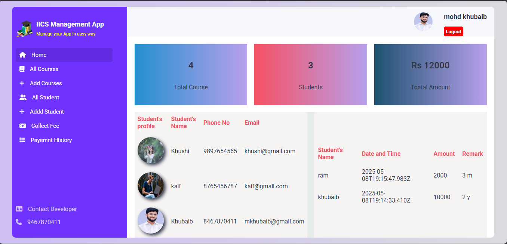
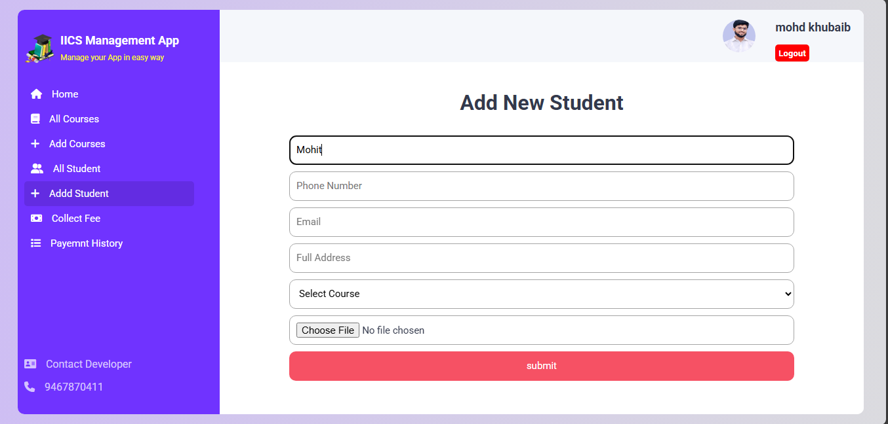
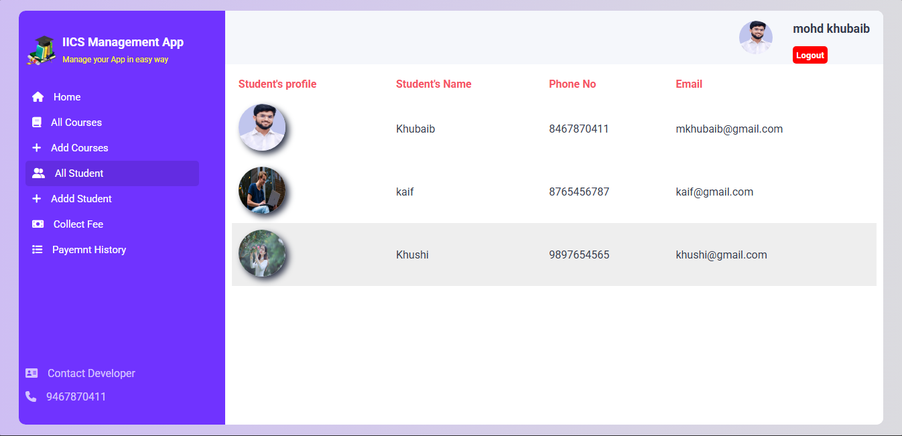
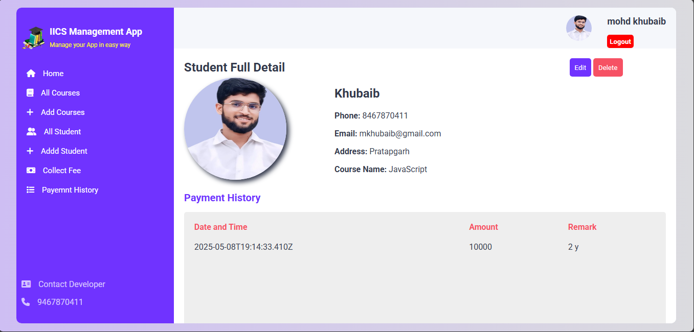
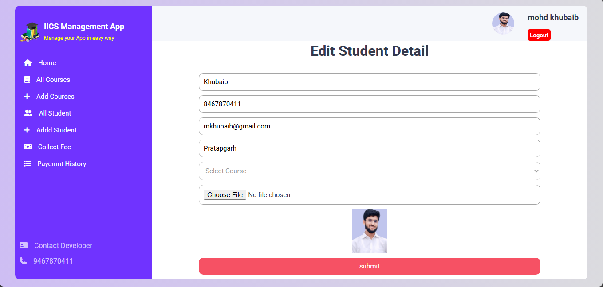
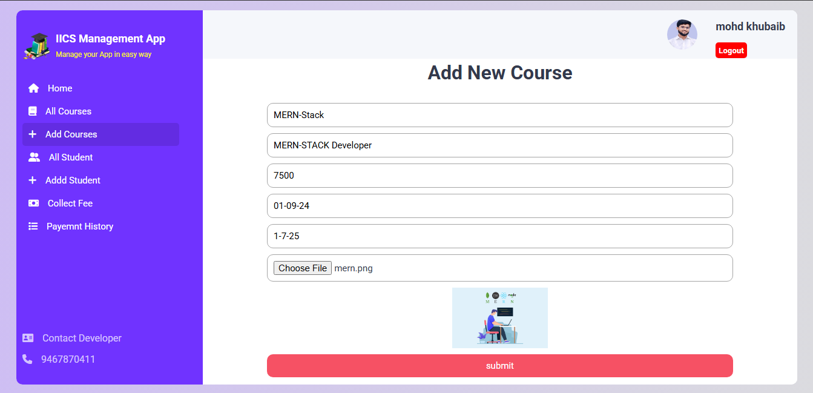
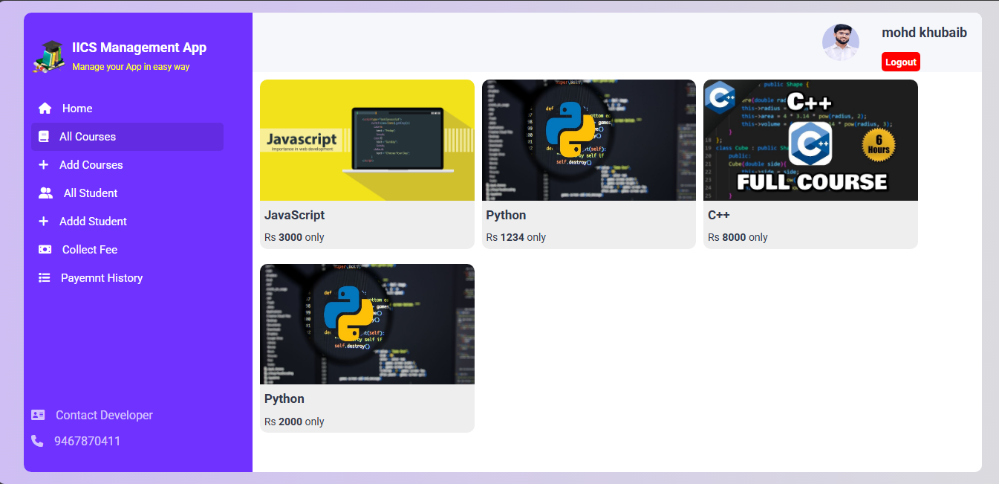
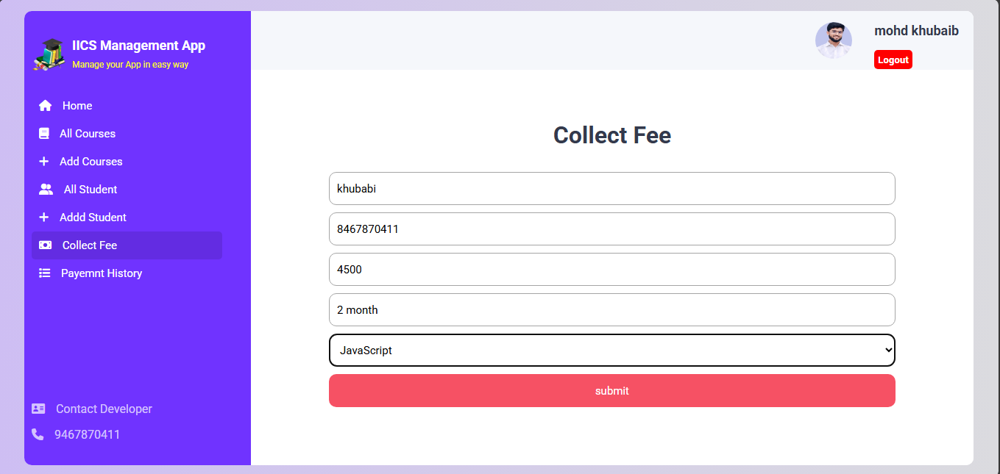
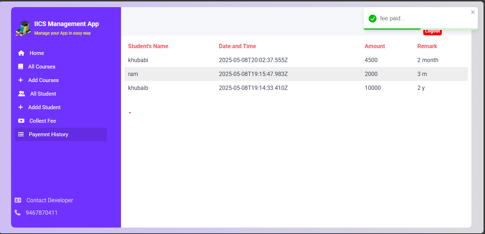

# 🎓 Institute Management System

A complete educational management web application built using **React.js**, with support for managing students, courses, and fees — all powered by local storage. This project includes secure user login/signup, responsive UI, and interactive dashboards.

---

## 📷 Screenshots

```
📸 Signup Form Page
📸 Login Form Page
📸 Home Page
📸 Add New Studetns Form Page
📸 All Students Page
📸 Studnt Details Page
📸 Student Details Edit Form Page
📸 Add New Course Form Page
📸 All Courses Page
📸 Course Edite Form Details Page
📸 Add Fee Form Page
📸 Fee History Table Pag
---

## 📷 Preview

```













---

## 🚀 Key Features

### 👤 Authentication
- 🔐 **User Login**
- 📝 **User Signup**
- 🏠 **Home Dashboard after login**

### 🧑‍🎓 Student Management
- ➕ Add New Student  
- ✏️ Edit Student Details  
- 📄 View Full Student Details  
- 🔁 Update Student Info  

### 📚 Course Management
- ➕ Add New Course  
- 🔁 Update Course Info  
- 📄 View Full Course Details  

### 💰 Fee & Payment System
- 💸 Add New Payment  
- ✅ Collect Fees from Students  
- 🕘 View Complete Payment History  

---

## 🛠️ Technologies Used

| Category           | Technology                          |
|--------------------|--------------------------------------|
| Frontend           | HTML, CSS, JavaScript                |
| Framework          | React.js                             |
| UI Icons           | Font Awesome                         |
| Data Storage       | Local Storage (Browser-Based)        |
| Version Control    | Git, GitHub                          |
| Code Editor        | VS Code                              |

---

## 📁 Folder Structure

```
Institute Management System/
├── api/ # Backend (Node.js + Express)
│ ├── middleware/ # Custom middleware files
│ ├── models/ # Data models: Course.js, Fees.js, Student.js, User.js
│ ├── nodemodule/ # Node modules (should be in .gitignore ideally)
│ ├── routes/ # Express routes: course.js, fee.js, student.js, user.js
│ ├── temp/ # Temporary files/folder
│ ├── .env # Environment variables file
│ ├── app.js # Backend app config
│ ├── package.json # Backend dependencies
│ ├── package-lock.json
│ └── server.js # Backend server entry point
│
├── iics/ # Frontend (React.js)
│ ├── node_modules/ # React dependencies (in .gitignore)
│ ├── public/ # Static assets and index.html
│ ├── src/ # React components, pages, assets
│ ├── .gitignore
│ ├── package.json # Frontend dependencies
│ ├── package-lock.json
│ └── README.md # Optional frontend README
│
└── README.md # This main README file
---

## 💻 How to Run Locally

```bash
# 1️⃣ Clone the repository
git clone https://github.com/Mohdkhubaib01/institute-management-system

# 2️⃣ Move to the project folder
cd institute-management-system

# 3️⃣ Install dependencies
npm install

# 4️⃣ Start the development server
npm start
```

App will run at: [http://localhost:3000](http://localhost:3000)

---

## 📌 Future Enhancements

- 🔐 Role-based Authentication (Admin, Student)
- 📱 Fully Responsive Mobile Layout
- 📊 Graphs & Charts for Fee Analytics
- 📨 Email notifications for due fees
- ☁️ Backend Integration with Firebase or Node.js

---

## 👨‍💻 Author

**Mohdkhubaib01**  
GitHub: [@Mohdkhubaib01](https://github.com/Mohdkhubaib01)

---

## 🌟 Support

If you liked this project, don’t forget to ⭐ the repository. Your support motivates me to build more!

---

## 📃 License

This project is licensed under the [MIT License](LICENSE).
